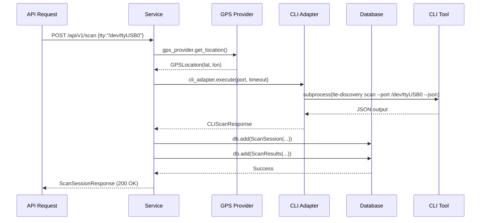

# Architecture Documentation

## Overview

This project follows **Clean Architecture** principles with a layered design. The architecture separates concerns into distinct layers with clear dependencies following the dependency rule: API → Service → Repository → Database.

```
                  REST API (API Layer)
                      │
              FastAPI Controllers / Routers
                      │
                Application Service Layer
                      │
        ┌───────────────┴───────────────┐
        │                             │
  CLI Adapter                   GPS Provider
        │                             │
   CLI Process               Mock / Serial GPS
        │
USB Modem LTE Discovery Engine (External CLI)
        │
    Cellular Network Data
```

---

## Layers

### 1. API Layer (FastAPI Routers)

**Responsibilities:**
- Request validation (via Pydantic schemas)
- Response formatting (via Pydantic models)
- Dependency Injection (FastAPI depends)
- WebSocket connections

**Location:** `app/api/routers/`

Files:
| File | Endpoint | Description |
|------|----------|-------------|
| `scan.py` | `POST /api/v1/scan` | Trigger LTE scan |
| `history.py` | `GET/DELETE /api/v1/scans` | List & delete scans |
| `settings.py` | `GET/PUT /api/v1/settings` | App settings management |
| `ws_gps.py` | `/ws/gps` | Realtime GPS updates |
| `ws_scan.py` | `/ws/scan` | Realtime scan events |

**Rule:** No business logic allowed in this layer.

---

### 2. Service Layer (Business Logic)

**Responsibilities:**
- Orchestrate workflows (ScanService)
- Handle query logic with pagination (HistoryService)
- Manage application state (SettingsService)

**Location:** `app/services/`

Services:
| Service | Responsibility |
|---------|----------------|
| ScanService | Orchestrates GPS → CLI → DB workflow |
| HistoryService | Query, paginate, delete scan history |
| SettingsService | CRUD for app settings |

Dependency Rule: Service → CLI Adapter OR Service → GPS Provider

---

### 3. Repository Layer (Data Access)

**Responsibilities:**
- CRUD operations on database entities
- No business logic
- SQLAlchemy ORM operations

**Location:** `app/repositories/`

Repositories:
| Repository | Model | Purpose |
|------------|-------|---------|
| ScanSessionRepository | scan_sessions | Session lifecycle |
| ScanResultRepository | scan_results | Individual scan results |
| SettingRepository | settings | Key-value app settings |

Dependency Rule: Repository → Database only

---

### 4. CLI Layer (Bridge to External Tool)

**Responsibilities:**
- Execute external `lte-discovery` CLI binary
- Handle subprocess, timeout, stdout/stderr
- Parse JSON output from CLI
- Map exceptions to domain errors

**Location:** `app/cli/`

Classes:
- `CLIAdapter` - Main interface to execute scans
- `CLIScanResponse` - Parsed CLI result container
- Exception classes (`CLIError`, `CLITimeoutError`, etc.)

Dependency Rule: ONLY CLI Adapter may call `subprocess.run()`

---

### 5. GPS Layer (Location Provider)

**Responsibilities:**
- Provide latitude/longitude coordinates
- Support multiple provider types via interface

**Location:** `app/gps/`

Providers:
| Provider | Implementation |
|----------|---------------|
| MockGPSProvider | Returns hardcoded Jakarta coordinates |
| SerialGPSProvider | Reads NMEA sentences from serial port |

Interface uses `Protocol` (Python structural subtyping):

```python
class GPSProvider(Protocol):
    def get_location(self) -> GPSLocation: ...
    def is_available(self) -> bool: ...
```

Dependency Rule: Only Service layer depends on GPS Provider

---

### 6. Data Layer (Database)

**ORM Models (SQLAlchemy):**
- `ScanSession` - Store scan metadata (TTY, time, location)
- `ScanResult` - Store individual network cells (Operator, MCC/MNC, RAT)
- `Setting` - Key-value persistent settings

**Migration System:**
- Alembic manages all schema changes
- Every model change requires an Alembic migration
- Never use raw SQL or `Base.metadata.create_all()`

**Connection:** SQLAlchemy 2.x with async-friendly session management

**Schema:** All tables created in `app` schema (not public)

---

## Dependency Rules

### ✅ Allowed Dependencies

```
API Layer
    ↓
Service Layer
    ↓
Repository Layer
    ↓
Database (ORM + Alembic)

Service Layer
    ↓
CLI Adapter (only allowed direct subprocess caller)

Service Layer
    ↓
GPS Provider (via protocol/interface)

API Layer ← Dependency Injection (from providers)
```

### ❌ Forbidden Dependencies

```
API Layer ↘
           ↘ (FORBID!) → Database Layer
Repository Layer ↗

Repository Layer ↘
                 ↘ (FORBID!) → CLI / Subprocess
CLI / GPS ↗

CLI / GPS ↘
          ↘ (FORBID!) → Database Layer
Repository Layer ↗
```

These rules prevent tight coupling and ensure testability.

---

## Startup Sequence



---

## Transaction Management

Each database operation uses a session-scoped transaction pattern:

```python
def create_tty_port(self, tty: str) -> ScanSession:
    session = ScanSession(tty_port=tty)
    self.db.add(session)
    self.db.commit()       # Persist to DB
    self.db.refresh(session)  # Refresh with DB-generated values
    return session
```

`autocommit=False, autoflush=False` in session configuration ensures explicit control over transactions.

---

## Error Handling Strategy

All errors are caught at the API layer and converted to standardized responses:

```python
@app.exception_handler(AppException)
async def app_exception_handler(req: Request, exc: AppException) -> JSONResponse:
    logger.error(f"AppException: {exc.detail}")
    return JSONResponse(status_code=exc.status_code, detail={"detail": exc.detail})

@app.exception_handler(Exception)
async def generic_exception_handler(req: Request, exc: Exception) -> JSONResponse:
    logger.exception(f"Unhandled exception: {exc}")
    return JSONResponse(status_code=500, detail={"detail": "Internal server error"})
```

**Never expose:** tracebacks, subprocess stderr, SQLAlchemy errors, passwords/secrets.

---

## Testing Strategy

### Unit Tests (mocked dependencies)
- Test each service in isolation by mocking CLI and GPS
- Test repository operations with SQLite in-memory database
- No physical hardware required

### Integration Tests (with real DB)
- Full HTTP requests via TestClient
- Real database schema exists (SQLite clone of PostgreSQL structure)
- Validates full request/response cycle

### End-to-End Tests
- Combined unit + integration approach
- Verifies complete data flow through all layers

### Coverage Target
Minimum 80% coverage across core modules (services, repositories, schemas).

---

## Future Roadmap

| Priority | Feature | Notes |
|----------|---------|-------|
| P1 | Authentication & User Management | JWT-based auth, RBAC |
| P2 | Prometheus Metrics | `/metrics` endpoint |
| P3 | Health Check Endpoint | `/healthz` with DB connectivity check |
| P4 | Multiple Modem Support | Track multiple USB ports simultaneously |
| P5 | Scheduled Scans | Cron-like scheduling for automated scans |
| P6 | Auto-trigger Scan | Listen for modem hotplug events |
| P7 | CSV/JSON Export | Download scan history |
| P8 | Real-time WebSocket Scans | Push new scan completions to clients |
